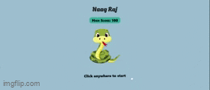

# NaagRaj 🐍




A Naagraj game built using React.js, HTML Canvas, and TypeScript.

## Table of Contents

- [Features](#features)
- [Getting Started](#getting-started)
- [Game Controls](#game-controls)
- [License](#license)

## Features

- Naagraj Snake gameplay.
- Built with React.js and HTML canvas.
- No third-party libraries used.
- TypeScript for type safety.
- Responsive design.
- Score tracking.
- Saves HighScore
- Game over screen with the option to restart.
- Keyboard controls for navigation.

## Getting Started

To run the game locally, follow these steps:

1. Clone this repository:

   ```shell
   git clone git@github.com:ankita-gupta-07/naagraj.git
   ```

2. Navigate to the project directory:

   ```shell
   cd naagraj
   ```

3. Install the required dependencies.

   ```shell
   npm install
   ```

4. Start the project:

   ```shell
   npm start
   ```

## Game Controls

Use the arrow keys or `W`,`A`,`S`,`D` keys on your keyboard to control the snake's direction:

- ↑ (Up) or `W` - Move Up
- ↓ (Down) or `S` - Move Down
- ← (Left) or `A` - Move Left
- → (Right) or `D` - Move Right

Others:

- To **Pause** the game - Press `esc` or click anywhere the screen

## License

This project is licensed under the MIT License - see the [LICENSE](./LICENSE) file for details.

